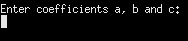

# Program that solves square equations.

This program solves square equations. To run a program you need
to enter 3 coefficients of square equations: a, b and c 
and press "Enter". After that, program will print number of roots and roots.

-[Input format](#Input)  
-[Output format](#Output)  
-[Documentation](#Documentation)  
-[Running a program](#Running-a-program)  

 ## Input
 
 Immediately after program starts you'll see following:
 
 

      
 </>
 
 Then need to enter 3 coefficients of square equation separating them with space symbols
 
 

      
 </>
 
 If you've entered symbols which are not numbers, it displays "Your input data contains invalid symbols".
 
  

      
 </>
 
 If you've entered less than 3 numbers, it displays "Enter 3 numbers!".
 
  

      
 </>
 
 ## Output
 
 Program displays roots in following style:  
 Number of roots: number of roots  
 Root(s): root1, root2.  
 
 

      
 </>
   
 
 ## Documentation
 
 All documentation is in <a href = "https://github.com/andreyStrachuk/solveSquareEquation/tree/master/doc"> doc</a> folder.
 
 
 ## Running a program
 
 To run this program you need to download CodeBlocks <a href = "https://www.codeblocks.org/downloads/binaries/"> here</a>. After that, download all files from this repository. Then you need to run CodeBlocks, open file solveSquareEquation.cbp and press "Build and run". 
